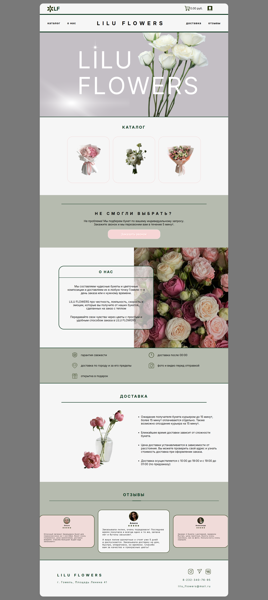
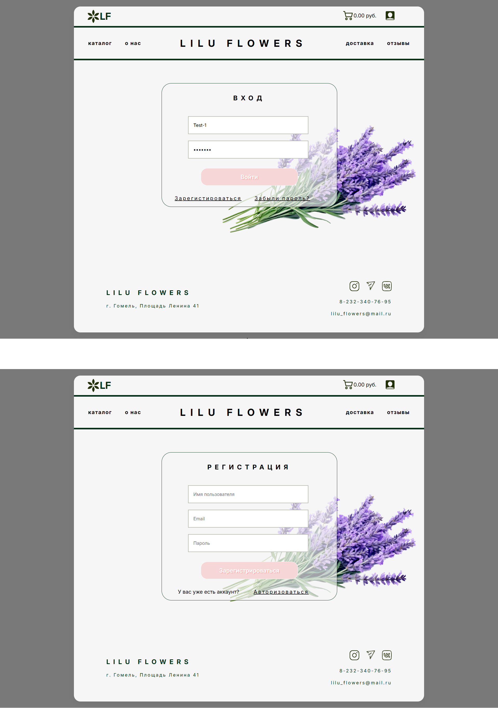
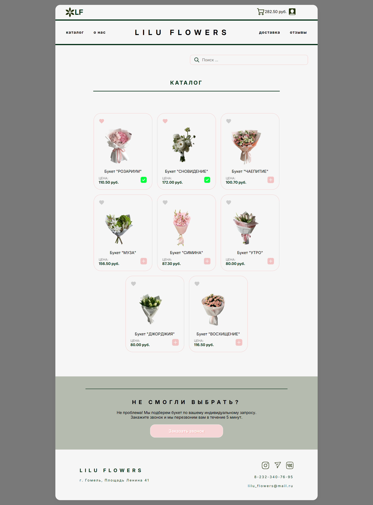
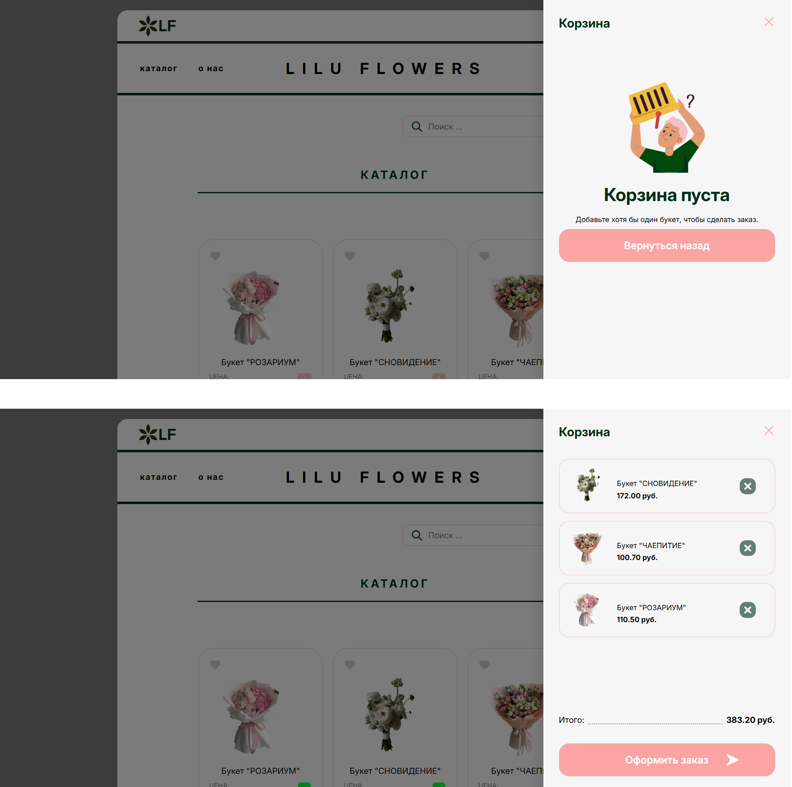
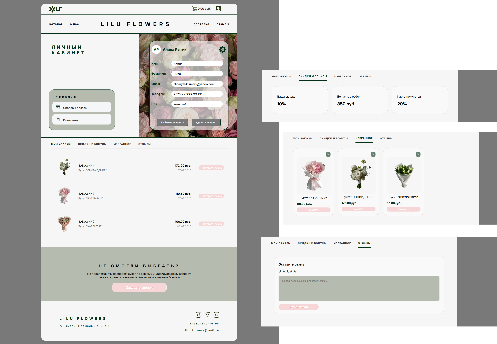
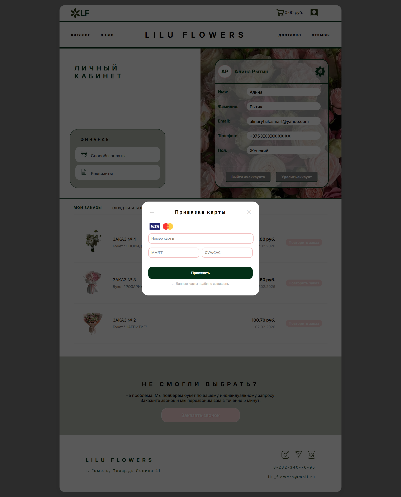

🌸 Flowers Online Store (Fullstack Project)

A fully functional e-commerce website for a flower shop. Users can browse the catalog, use filters and add items to the cart. User registration and authorization, login to your personal account, where you can link your bank card, view "favorites," "discounts and bonuses," "reviews," and "orders." 

[🔗 Live Demo]
(temporarily unavailable...)


#📋 Project Overview
This project was created to demonstrate my ability to build a complete web application from scratch, connecting a React frontend with a Python (Django REST Framework) backend.

## Key Features:
- **Product Catalog:** Browsing flowers with categories and pricing.
- **Advanced Filtering:** Filter by type, or name.
- **Shopping Cart:** Full cart logic (add, remove, update quantity).
- **Favorites System:** Users can save flowers they like (connected to the backend).
- **Responsive Layout:** Pixel-perfect design that works on all devices (Desktop, Tablet, Mobile).


# 🛠 Tech Stack
**Frontend:**
- **React.js** (Hooks, Functional Components)
- **JavaScript** (ES6+)
- **SCSS / SASS** (using BEM methodology)
- **React Router** (for SPA navigation)
- **Axios** (for API communication)

**Backend:**
- **Python**
- **Django REST Framework** (API development)
- **SQLite / PostgreSQL** (Database)


## 📸 Скриншоты проекта

### Главная страница и Вход/Регистрация. 
<p align="center">
  
  
</p>

### Каталог и корзина
<p align="center">
  
  
</p>

### Личный кабинет и подвязка карты
<p align="center">
  
  
</p>

# ⚙️ How to Run Locally

##1. Clone the repository
```bash
git clone https://github.com/Alina-Rytsik/React-Flowers.git

##2. Setup Backend
code
Bash
cd backend
python -m venv venv
source venv/bin/activate  # On Windows: venv\Scripts\activate
pip install -r requirements.txt
python manage.py migrate
python manage.py runserver

##3. Setup Frontend
code
Bash
npm install
npm start


👩‍💻 About the Author
Alina Rytsik
Junior Frontend Developer with a focus on React and a solid understanding of Python/Django.
LinkedIn: https://www.linkedin.com/in/alina-rytsik-0a4295257/
Telegram: @AlinaRM7
